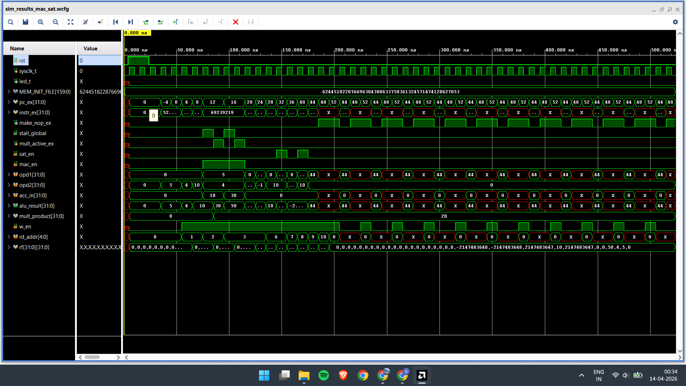
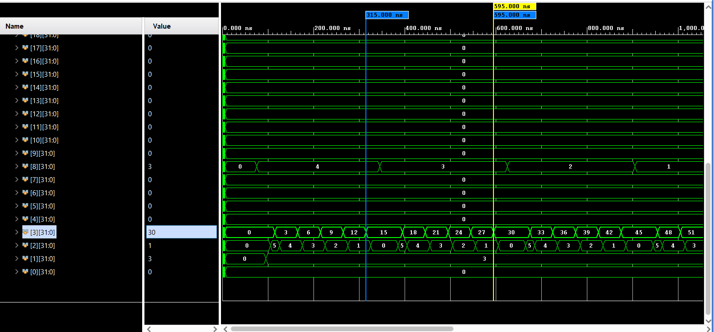
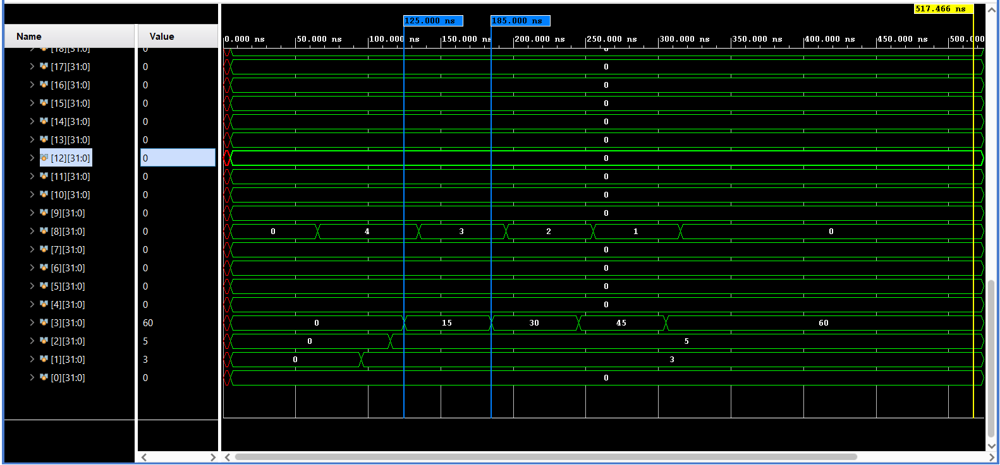

# RV32I Custom DSP Core for Signal Processing Workloads

This repository documents the architectural redesign, implementation, and performance characteristics of a custom RV32I-based processor extended with Digital Signal Processing (DSP) acceleration hardware. The project explores the performance advantages of localized, application-specific ISA extensions against a standard RV32I baseline architecture, targeting signal processing kernels such as FIR (Finite Impulse Response) filters.

## 1. Architectural & Hardware Differences

The fundamental differences between the Base V-FRONT (Pure RV32I) core and the Custom DSP Modified core lie in the datapath routing and execution stage capabilities.

| Feature | Base V-FRONT (Pure RV32I) | Custom DSP Modified Core |
| :--- | :--- | :--- |
| **Multiplication Support** | None. Requires software emulation via repeated addition. | Hardware DSP48E1 multiplier inferred in the ALU. |
| **Register File (RF)** | 2 Read Ports, 1 Write Port. | Extended to 3 Read Ports, 1 Write Port. |
| **Accumulation** | Requires a separate `add` instruction. | Handled internally in a single `mac` instruction. |
| **Arithmetic Clamping**| Standard overflow (wrap-around). | Saturating logic (`sat_en`) clamps at `0x7FFFFFFF` / `0x80000000`. |
| **Hazard Management** | Standard forwarding (EX-to-EX, MEM-to-EX). | Custom `stall_global` unit freezes PC and IF/ID for 1 cycle to handle the 2-cycle DSP latency. |

## 2. Hardware Implementation & Synthesis Cost

Achieving the targeted speedups requires extra silicon. Adding the 3rd read port to the register file, the DSP multiplier, and the saturating logic increases the physical footprint of the processor. Synthesis was targeted for the Xilinx Zynq-7000 (`xc7z010clg400-1`).

**Area / Logic Utilization:**
*   **Slice LUTs:** 2,633 out of 17,600 (14.96%)
*   **Slice Registers:** 2,128 out of 35,200 (6.05%)
*   **BRAM:** 12 out of 60 (20.00%)
*   **DSP48E1 Slices:** 3 out of 80 (3.75%) _(Confirms the hardware multiplier was successfully synthesized and mapped)_

**Timing & Power Characteristics:**
*   **Target Clock:** 10 ns
*   **Worst Negative Slack (WNS):** +5.537 ns
*   **Critical Path Delay:** 4.463 ns
*   **Maximum Frequency ($F_{max}$):** $\approx \mathbf{224\text{ MHz}}$
*   **Total On-Chip Power:** 0.11 W (0.017 W Dynamic / 0.093 W Static)

### Hardware Simulations
**MAC & Saturating Arithmetic Validation**


## 3. Software Execution: FIR Filter Benchmark

Because the baseline architecture lacks the hardware to multiply, the compiler is forced to alter the mathematical approach, resulting in massive differences in instruction fetch bandwidth.

### The Baseline Approach (Software Loop)
To compute a single tap ($y[n] += h \times x$), the baseline uses repeated addition. It fetches an inner loop that adds the weight $h$ to the accumulator $x$ times.
*   **Assembly Structure:** `addi` (setup inner counter), `add` (accumulate), `addi` (decrement counter), `bne` (repeat loop).
*   **Instruction Bandwidth:** 4 instructions fetched repeatedly per tap.



### The Custom DSP Approach (Hardware MAC)
The modified core executes the multiplication and addition simultaneously.
*   **Assembly Structure:** `mac` (multiply and accumulate), `addi` (decrement outer tap counter), `bne` (repeat loop).
*   **Instruction Bandwidth:** 3 instructions fetched per tap.
*   **Result:** The custom core achieves a 25% reduction in dynamic instruction fetch bandwidth per filter tap.



## 4. Performance & Cycle Analysis

The empirical data extracted from Vivado waveform simulations. The time delta was measured for one complete FIR filter tap calculation.

| Metric | Base V-FRONT Core | Custom DSP Core | Improvement |
| :--- | :--- | :--- | :--- |
| **Time Delta (Vivado)** | 280 ns | 60 ns | - 220 ns |
| **Clock Cycles per Tap**| 28 cycles | 6 cycles | **78.5% Reduction** |
| **Instructions per Tap**| 4 instructions | 3 instructions | **25.0% Reduction** |
| **Cycles Per Instruction (CPI)**| $28 / 4 = \mathbf{7.0}$ | $6 / 3 = \mathbf{2.0}$ | **71.4% Reduction** |

### Overall Engineering Speedup
Using the cycle counts, the overall execution speedup of the architecture is calculated as:
$$ Speedup = \frac{\text{Baseline Cycles}}{\text{Custom Cycles}} = \frac{28}{6} = \mathbf{4.66x} $$

The custom hardware executes the DSP workload **366% faster** than the baseline processor.

## 5. Development Workflow: Compiling Assembly to `.mem`
To translate RISC-V assembly test cases into Verilog `$readmemh` compatible `.mem` files, the standard `riscv-gnu-toolchain` was used under WSL (Windows Subsystem for Linux).

```bash
# 1. Compile assembly to an ELF executing starting at address 0x0
# (Using link.ld to ensure text section placement)
riscv64-unknown-elf-gcc -march=rv32i -mabi=ilp32 -nostdlib -T link.ld -o fir.elf fir.S

# 2. Extract the raw binary instruction machine code from the ELF
riscv64-unknown-elf-objcopy -O binary fir.elf fir.bin

# 3. Convert the binary to hexadecimal representation (.mem format)
# -e for little-endian encoding, -u for uppercase, -c 4 for 4 bytes per line
xxd -e -u -p -c 4 fir.bin > fir_custom.mem
```

This output represents exactly the sequence of 32-bit little-endian instruction hex strings required to load into instruction ROM.

## 6. Conclusion
While the modified core incurs a slight area penalty due to the widened register file and dedicated DSP slices, the architectural trade-off is overwhelmingly positive for signal processing workloads. By eliminating the need for software-emulated multiplication, the custom `mac` instruction reduces the dynamic instruction count by 25% and drops the effective CPI from 7.0 to 2.0. This translates to an overall end-to-end execution speedup of **4.66x**, definitively proving that localized, application-specific ISA extensions are highly efficient for removing pipeline bottlenecks in computational kernels.
