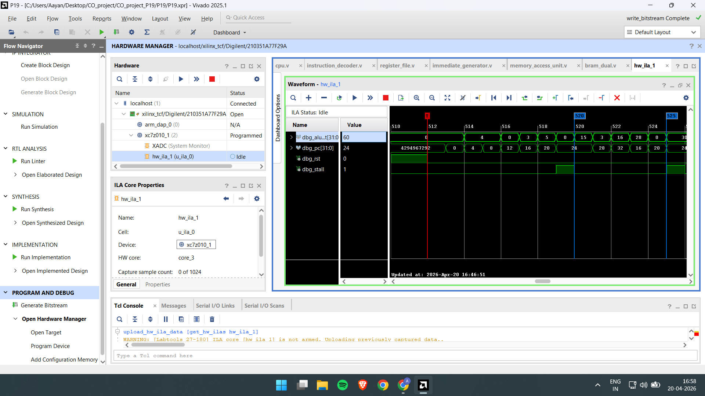
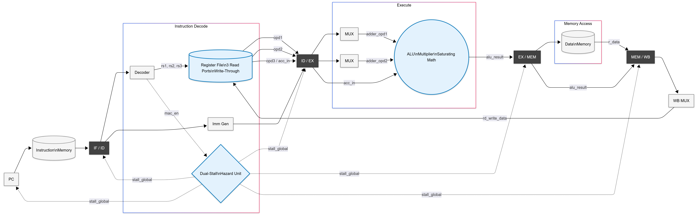

# RV32I Custom DSP Core for Signal Processing Workloads

This repository documents the architectural redesign, implementation, and performance characteristics of a custom RV32I-based processor extended with Digital Signal Processing (DSP) acceleration hardware. The project explores the performance advantages of localized, application-specific ISA extensions against a standard RV32I baseline architecture, targeting signal processing kernels such as FIR (Finite Impulse Response) filters. The baseline core was derived from the V-FRONT project on GitHub, and the ALU building blocks used in this work are based on `luftALU`.

## 1. Architectural & Hardware Differences

The fundamental differences between the Base V-FRONT (Pure RV32I) core and the Custom DSP Modified core lie in the datapath routing and execution stage capabilities.

| Feature | Base V-FRONT (Pure RV32I) | Custom DSP Modified Core |
| :--- | :--- | :--- |
| **Multiplication Support** | None. Requires software emulation via repeated addition. | 2-cycle sequential multiplier inferred in the ALU. |
| **Register File (RF)** | 2 Read Ports, 1 Write Port. | Extended to 3 Read Ports (`rs1`, `rs2`, `rs3`), 1 Write Port. |
| **Accumulation** | Requires a separate `add` instruction. | Handled internally in a single `mac` instruction. |
| **Arithmetic Clamping**| Standard overflow (wrap-around). | Saturating logic introduced via `sadd` and `ssub` instructions. |
| **Hazard Management** | Standard forwarding (EX-to-EX, MEM-to-EX). | Deterministic dual-stall hazard detection unit freezes the pipeline to handle multi-cycle latency. |

## 2. Hardware Implementation & Synthesis Cost

Achieving the targeted speedups requires extra silicon. Adding the 3rd read port to the register file, the DSP multiplier, and the saturating logic increases the physical footprint of the processor. Synthesis and implementation were targeted and physically confirmed on a **Xilinx Zybo Z7-10** FPGA.

**Implementation Costs vs Baseline:**
*   **Area / Logic Utilization:** A 26.8% rise in LUT utilization.
*   **Operating Frequency:** A modest 7.5% drop in maximum operating frequency ($F_{max}$), confirming the localized DSP extension is a worthwhile architectural trade-off for edge-compute devices.

### Hardware Validation with Integrated Logic Analyzer (ILA)
To verify functionality on actual silicon, the synthesized design was programmed onto the Zybo Z7-10 FPGA and monitored using the Vivado Integrated Logic Analyzer (ILA).


*(Above: Real-time on-chip observation confirming successful execution of DSP instructions via Vivado ILA.)*



### Hardware Simulations
**MAC & Saturating Arithmetic Validation**


## 3. Software Execution: FIR Filter Benchmark

Because the baseline architecture lacks the hardware to multiply, the compiler is forced to alter the mathematical approach, resulting in massive differences in instruction fetch bandwidth.

### The Baseline Approach (Software Loop)
To compute a single tap ($y[n] += h \times x$), the baseline uses repeated addition. It fetches an inner loop that adds the weight $h$ to the accumulator $x$ times.
*   **Assembly Structure:** `addi` (setup inner counter), `add` (accumulate), `addi` (decrement counter), `bne` (repeat loop).
*   **Instruction Bandwidth:** 4 instructions fetched repeatedly per tap.


### The Custom DSP Approach (Hardware MAC)
The modified core executes the multiplication and addition simultaneously.
*   **Assembly Structure:** `mac` (multiply and accumulate), `addi` (decrement outer tap counter), `bne` (repeat loop).
*   **Instruction Bandwidth:** 3 instructions fetched per tap.
*   **Result:** The custom core achieves a 25% reduction in dynamic instruction fetch bandwidth per filter tap.


## 4. Performance & Cycle Analysis

Empirical performance data extracted for a 4-tap FIR filter benchmark validates the architectural modifications.

| Metric | Improvement with Custom DSP Core |
| :--- | :--- |
| **Total Execution Cycles** | **74.0% Reduction** |
| **Dynamic Instruction Count** | **75.5% Reduction** |

### Overall Engineering Speedup
By eliminating the need for repeating software-emulated additions and branches required for multiplication and overflow handling, the hardware natively executes the operations. The 74% reduction in execution cycles confirms that the dedicated DSP hardware is a highly effective architectural trade-off.

## 5. Development Workflow: Compiling Assembly to `.mem`
To translate RISC-V assembly test cases into Verilog `$readmemh` compatible `.mem` files, the standard `riscv-gnu-toolchain` was used under WSL (Windows Subsystem for Linux).

```bash
# 1. Compile assembly to an ELF executing starting at address 0x0
# (Using link.ld to ensure text section placement)
riscv64-unknown-elf-gcc -march=rv32i -mabi=ilp32 -nostdlib -T link.ld -o fir.elf fir.S

# 2. Extract the raw binary instruction machine code from the ELF
riscv64-unknown-elf-objcopy -O binary fir.elf fir.bin

# 3. Convert the binary to hexadecimal representation (.mem format)
# -e for little-endian encoding, -u for uppercase, -c 4 for 4 bytes per line
xxd -e -u -p -c 4 fir.bin > fir_custom.mem
```

This output represents exactly the sequence of 32-bit little-endian instruction hex strings required to load into instruction ROM.

## 6. References and Attribution
The baseline processor used for comparison in this project comes from the V-FRONT repository on GitHub: https://github.com/kagandikmen/V-FRONT

The ALU structure used in the custom core is based on the `luftALU` implementation included in this repository.

## 7. Conclusion
While the modified core incurs an area penalty due to the widened register file (3 read ports) and the 2-cycle sequential multiplier logic, the architectural trade-off is overwhelmingly positive for signal processing workloads. By substituting software-emulated multiplication loops with a dedicated, hardware-accelerated `mac` instruction—and resolving overflow naturally with `sadd`/`ssub`—the core achieves a 75.5% drop in dynamic instruction count for FIR kernels. This optimization delivers execution in only 26% of the baseline cycles, conclusively demonstrating the impact of specialized ISA extensions on edge RISC-V devices.
